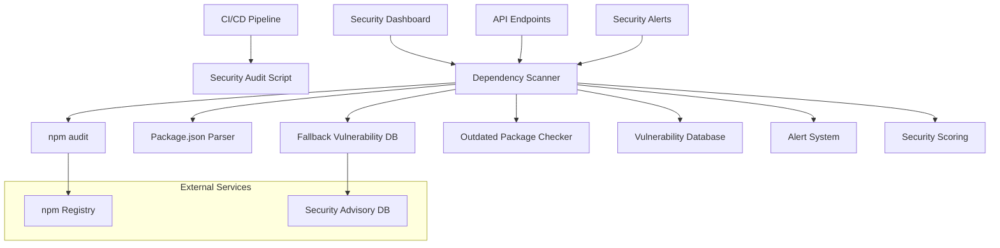

# Design Document

## Overview

The Dependency Security Scanning system provides comprehensive vulnerability detection, risk assessment, and automated monitoring for all third-party dependencies. The system integrates with npm audit, provides fallback vulnerability detection, and includes real-time alerting and dashboard integration. This design builds upon the existing security infrastructure to provide enterprise-grade dependency security management.

## Architecture

### High-Level Architecture



### Component Architecture

The system follows a modular architecture with clear separation of concerns:

1. **Core Scanner Engine** - Main scanning logic and orchestration
2. **Vulnerability Detection** - Multiple detection methods with fallback
3. **Risk Assessment** - Severity classification and risk scoring
4. **Alert Integration** - Real-time notifications for critical issues
5. **API Layer** - RESTful endpoints for external integration
6. **Dashboard Integration** - Real-time security metrics display

## Components and Interfaces

### 1. DependencySecurityScanner Class

**Purpose**: Core scanning engine that orchestrates all dependency security checks

**Key Methods**:
- `runScan()`: Executes comprehensive dependency security scan
- `runNpmAudit()`: Primary vulnerability detection via npm audit
- `getDependencyInfo()`: Extracts dependency metadata from package.json
- `checkOutdatedPackages()`: Identifies packages with available updates
- `fallbackVulnerabilityCheck()`: Secondary vulnerability detection method

**Interfaces**:
```typescript
interface ScanResult {
  timestamp: string
  vulnerabilities: Vulnerability[]
  dependencies: DependencyInfo[]
  summary: VulnerabilitySummary
  recommendations: string[]
  overallRisk: 'low' | 'moderate' | 'high' | 'critical'
}

interface Vulnerability {
  id: string
  title: string
  severity: 'low' | 'moderate' | 'high' | 'critical'
  package: string
  version: string
  patchedIn?: string
  overview: string
  recommendation: string
  references: string[]
  cwe?: string[]
  cvss?: CVSSInfo
}

interface DependencyInfo {
  name: string
  version: string
  description?: string
  license?: string
  dependencies?: string[]
  devDependency: boolean
  outdated: boolean
  latestVersion?: string
}
```

### 2. API Endpoints (/api/security/dependencies)

**Purpose**: RESTful API for programmatic access to dependency security data

**Endpoints**:
- `GET ?action=scan`: Full dependency security scan
- `GET ?action=vulnerabilities`: Vulnerability-specific data
- `GET ?action=outdated`: Outdated package information
- `GET ?action=summary`: High-level security summary
- `GET ?action=recommendations`: Security recommendations
- `POST`: Trigger new scan with optional force rescan

**Response Format**:
```typescript
interface APIResponse {
  success: boolean
  data?: any
  error?: string
  timestamp: string
  metadata?: {
    scanDuration?: number
    cacheStatus?: string
    totalPackages?: number
  }
}
```

### 3. CI/CD Integration Script

**Purpose**: Standalone script for automated security scanning in build pipelines

**Features**:
- Configurable failure thresholds (critical/high vulnerability limits)
- Machine-readable JSON output for further processing
- Timeout handling for long-running scans
- Exit codes for CI/CD decision making
- Verbose logging for debugging

**Configuration**:
```typescript
interface CIConfig {
  failOnCritical: boolean
  failOnHigh: boolean
  maxHighVulnerabilities: number
  outputFile: string
  timeoutMs: number
  verbose: boolean
}
```

### 4. Security Dashboard Integration

**Purpose**: Real-time dependency security metrics in the main security dashboard

**Integration Points**:
- Vulnerability count display with severity breakdown
- Overall risk assessment indicator
- Outdated package count and recommendations
- Security score calculation including dependency risks
- Historical trend tracking

**Dashboard Data Structure**:
```typescript
interface DashboardDependencyData {
  vulnerabilities: VulnerabilitySummary
  overallRisk: string
  totalPackages: number
  outdatedPackages: number
  criticalVulnerabilities: Vulnerability[]
  recommendations: string[]
  lastScanTime: string
  scanStatus: 'success' | 'partial' | 'failed'
}
```

### 5. Alert System Integration

**Purpose**: Real-time notifications for critical dependency security events

**Alert Types**:
- **Critical Alerts**: Immediate notification for critical vulnerabilities
- **High Severity Alerts**: Notification when multiple high-severity issues found
- **Bulk Update Alerts**: Notification when many packages need updates

**Alert Data Structure**:
```typescript
interface DependencyAlert {
  type: 'critical' | 'high' | 'moderate'
  title: string
  message: string
  vulnerabilities: VulnerabilityReference[]
  recommendations: string[]
  urgency: 'immediate' | 'within_24h' | 'within_week'
}
```

## Data Models

### Vulnerability Data Model

The vulnerability model captures comprehensive security information:

```typescript
interface Vulnerability {
  // Identification
  id: string                    // Unique vulnerability identifier
  title: string                 // Human-readable vulnerability title
  
  // Classification
  severity: 'low' | 'moderate' | 'high' | 'critical'
  cwe?: string[]               // Common Weakness Enumeration IDs
  cvss?: {                     // Common Vulnerability Scoring System
    score: number
    vectorString: string
  }
  
  // Package Information
  package: string              // Affected package name
  version: string              // Vulnerable version range
  patchedIn?: string          // Version that fixes the vulnerability
  
  // Details
  overview: string             // Vulnerability description
  recommendation: string       // Remediation guidance
  references: string[]         // External references and links
  
  // Metadata
  discoveredAt?: string        // When vulnerability was first detected
  source: 'npm_audit' | 'fallback' | 'manual'
}
```

### Dependency Information Model

The dependency model tracks package metadata and update status:

```typescript
interface DependencyInfo {
  // Basic Information
  name: string                 // Package name
  version: string              // Currently installed version
  description?: string         // Package description
  license?: string             // Package license
  
  // Dependency Tree
  dependencies?: string[]      // Direct dependencies
  devDependency: boolean       // Whether it's a dev dependency
  
  // Update Information
  outdated: boolean            // Whether updates are available
  latestVersion?: string       // Latest available version
  updateType?: 'major' | 'minor' | 'patch'
  
  // Security Metadata
  vulnerabilityCount?: number  // Number of known vulnerabilities
  lastSecurityUpdate?: string  // Date of last security-related update
  riskLevel?: 'low' | 'moderate' | 'high' | 'critical'
}
```

### Scan Result Model

The scan result aggregates all security information:

```typescript
interface ScanResult {
  // Metadata
  timestamp: string            // Scan execution time
  scanId: string              // Unique scan identifier
  duration: number            // Scan duration in milliseconds
  
  // Results
  vulnerabilities: Vulnerability[]
  dependencies: DependencyInfo[]
  
  // Summary Statistics
  summary: {
    total: number              // Total vulnerabilities found
    critical: number           // Critical severity count
    high: number              // High severity count
    moderate: number           // Moderate severity count
    low: number               // Low severity count
  }
  
  // Analysis
  recommendations: string[]    // Prioritized recommendations
  overallRisk: 'low' | 'moderate' | 'high' | 'critical'
  securityScore: number       // Calculated security score (0-100)
  
  // Status
  scanStatus: 'complete' | 'partial' | 'failed'
  errors?: string[]           // Any errors encountered during scan
}
```

## Error Handling

### Graceful Degradation Strategy

The system implements multiple layers of error handling to ensure reliable operation:

1. **Primary Method Failure**: If npm audit fails, automatically fall back to known vulnerability database
2. **Network Timeout**: Implement configurable timeouts with graceful failure
3. **Parsing Errors**: Handle malformed JSON responses with detailed error logging
4. **Missing Dependencies**: Continue scan even if some package information is unavailable

### Error Classification

```typescript
enum ScanErrorType {
  NETWORK_TIMEOUT = 'network_timeout',
  PARSE_ERROR = 'parse_error',
  COMMAND_FAILED = 'command_failed',
  PERMISSION_DENIED = 'permission_denied',
  PACKAGE_NOT_FOUND = 'package_not_found'
}

interface ScanError {
  type: ScanErrorType
  message: string
  context?: any
  recoverable: boolean
  fallbackUsed: boolean
}
```

### Recovery Mechanisms

- **Fallback Vulnerability Database**: Known vulnerable packages with version ranges
- **Cached Results**: Use previous scan results if current scan fails completely
- **Partial Results**: Return available data even if some components fail
- **Retry Logic**: Automatic retry with exponential backoff for transient failures

## Testing Strategy

### Unit Testing

**Scanner Core Logic**:
- Vulnerability detection accuracy
- Risk calculation algorithms
- Recommendation generation logic
- Error handling and recovery

**API Endpoints**:
- Response format validation
- Error handling scenarios
- Authentication and authorization
- Rate limiting behavior

### Integration Testing

**npm Audit Integration**:
- Real vulnerability detection with test packages
- Timeout handling with slow responses
- Malformed response handling

**Alert System Integration**:
- Critical vulnerability alert triggering
- Alert threshold configuration
- Notification delivery verification

### End-to-End Testing

**CI/CD Pipeline Integration**:
- Build failure on critical vulnerabilities
- Report generation and storage
- Performance under load

**Dashboard Integration**:
- Real-time data updates
- Error state handling
- User interaction flows

### Security Testing

**Input Validation**:
- Malicious package.json content
- Command injection prevention
- Path traversal protection

**Output Sanitization**:
- Vulnerability description sanitization
- Log injection prevention
- XSS prevention in dashboard display

## Performance Considerations

### Scan Optimization

- **Parallel Processing**: Run npm audit and package analysis concurrently
- **Caching Strategy**: Cache scan results for configurable duration
- **Incremental Scans**: Only rescan changed dependencies when possible
- **Timeout Management**: Configurable timeouts to prevent hanging scans

### Resource Management

- **Memory Usage**: Stream large JSON responses instead of loading entirely in memory
- **CPU Usage**: Limit concurrent scans to prevent system overload
- **Network Usage**: Batch API calls and implement request throttling

### Scalability

- **Horizontal Scaling**: Design for multiple concurrent scan instances
- **Database Integration**: Optional database storage for large-scale deployments
- **Queue System**: Background job processing for non-blocking scans

## Security Considerations

### Secure Command Execution

- **Input Sanitization**: Validate all inputs before shell command execution
- **Command Injection Prevention**: Use parameterized commands and input validation
- **Privilege Limitation**: Run scans with minimal required permissions

### Data Protection

- **Sensitive Information**: Prevent exposure of internal paths and configuration
- **Log Security**: Sanitize logs to prevent information disclosure
- **API Security**: Implement authentication and rate limiting for API endpoints

### Vulnerability Database Security

- **Source Verification**: Verify integrity of vulnerability data sources
- **Update Security**: Secure update mechanism for fallback vulnerability database
- **Access Control**: Restrict access to vulnerability scanning endpoints

## Deployment Considerations

### Environment Configuration

```typescript
interface DeploymentConfig {
  // Scanning Configuration
  scanTimeout: number          // Maximum scan duration
  cacheTimeout: number         // Result cache duration
  maxConcurrentScans: number   // Concurrent scan limit
  
  // Alert Configuration
  alertThresholds: {
    critical: number           // Critical vulnerability threshold
    high: number              // High vulnerability threshold
    outdated: number          // Outdated package threshold
  }
  
  // Integration Configuration
  enableDashboard: boolean     // Dashboard integration
  enableAlerts: boolean        // Alert system integration
  enableCICD: boolean         // CI/CD integration
  
  // Performance Configuration
  enableCaching: boolean       // Result caching
  enableParallelScans: boolean // Parallel processing
}
```

### Production Deployment

- **Environment Variables**: Secure configuration management
- **Monitoring**: Health checks and performance monitoring
- **Logging**: Structured logging with appropriate levels
- **Backup**: Regular backup of scan results and configuration

### Development Environment

- **Mock Data**: Test data for development and testing
- **Debug Mode**: Enhanced logging and error reporting
- **Hot Reload**: Development-friendly configuration updates